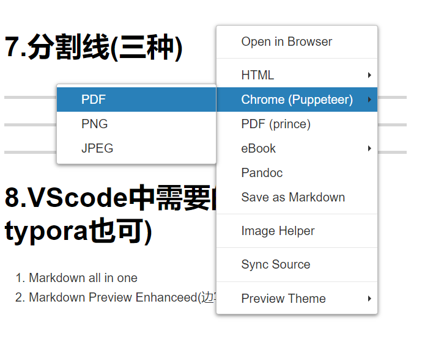

## 参考
https://github.com/younghz/Markdown

-------------------------------
# 1.字体
## 1.1粗体
**Do not go gentle into that good night[^二十四个年头]**

[^二十四个年头]:不要温顺地走进那安息的长夜
## 1.2斜体
*Do not go gentle into that good night*

## 1.3删除线
~~Do not go gentle into that good night~~

## 1.4代码块
### 1.4.1其中一种
    print('Do not go gentle into that good night')


### 1.4.2行内高亮代码
可以直接从使用命令``import numapy as np``导入相应的库


### 1.4.3指定语言
**例如python语言**
```python
print('Do not go gentle into that good night')
```

### 1.4.4Markdown支持的常见代码块种类及关键字

+ **Shell**：bash , shell
+ **C**:cpp , c
+ **Java**:	java
+ **JavaScript**:js , jscript , javascript
+ **PHP**:php
+ **Python**:	py , python
+ **SQL**:sql
+ **matlab**:matlab
+ **GO**:go , golang
+ **R**:r , s , splus
+ **tex**:tex


## 1.5脚注

这里有一只只因[^只因]。


[^只因]:鸡（小黑子）

# 2.引用
*Do not go gentle into that good night*
>狄兰·托马斯[^迪兰·托马斯]
>>狄兰·托马斯
>>>狄兰·托马斯

[^迪兰·托马斯]:迪伦·托马斯（Dylan Thomas，1914.10.27 －1953.11.9)，威尔士诗人。出生于威尔士的斯旺西。父亲是学校的英文教师，迪伦从中学时代就显露出诗歌天分，毕业后当了报社记者。出版了一系列诗集，也从事剧本和小说创作。1950-1953年间三度前往美国。于1953年在纽约病逝。

## 1.6自定义风格

<font color="red" size="60pt">注意:</font>
<p style="color : red ;font : normal 26pt '微软雅黑'">hello</p>


# 2.图片插入

## 2.1简单插入图片
 
## 2.2图片居中并排显示(可以调节大小)
<center class="half">


</center>

## 2.3图片左对齐并排显示

<figure>


</figure>


## 2.4并排显示在表格中且加上下表图注

\<tr>：表示 table row ——同一行的内容都放到这个标签中  

\<td>：表示 table data,——每一张图片的数据都放在这个里


单纯的整活(~~没有别的意思~~)
<table>
    <tr>
        <td ><center>Fig1  新垣结衣 </center></td>
        <td ><center>Fig2 新垣结衣</center></td>
    </tr>
    <tr>
        <td><center>Fig3 John</center></td>
        <td ><center>Fig4 John</center> </td>
    </tr>
</table>

## 2.5表情(Markdown自带的emoji)

[各种表情指令汇总链接](https://www.webfx.com/tools/emoji-cheat-sheet/)

:smile:
:sweat_smile:(:older_man:最爱的流汗黄豆)


# 3.超链接

## 3.1行内式

[cvpr_seminar_006](https://github.com/lzu-cvpr/cvpr_seminar_006)

## 3.2参考式

[cvpr_seminar_006][1]

[1]:https://github.com/lzu-cvpr/cvpr_seminar_006


## 3.3直接链接
~~<https://www.pronhub.com>~~(搞错了)

<https://www.marxists.org/chinese/index.html>(这才是当代青年应该学习的)


## 3.4文章内的链接
跳转到文章内某处:[引用](#引用)


# 4.表格

用`|`表示表格纵向边界，表头和表内容用`-`隔开，并可用`:`进行对齐设置，两边都有`:`则表示居中，若不加`:`则默认左对齐

|网站                              |链接                                |
|:------------------------------------:|------------------------------------|
|114                              |[https://github.com/marmotxcw/markdown-beamer](https://github.com/marmotxcw/markdown-beamer)|
|514                              |[https://github.com/marmotxcw/markdown-beamer](https://github.com/marmotxcw/markdown-beamer)|


# 5.列表
**无标号的**
+ 啊
- 哼哼啊哼啊
+ 啊啊啊啊啊啊啊

---------------------------
**有标号的**

1. 正确的
2. 中肯的
3. 客观的

---------------------------

**嵌套**

1.练习生
  + 唱
  + 跳
  + rap
  + 篮球


# 6.公式
**类似于latex**


$\alpha$,$\beta$,$\omega$

$$e^{ix}=\cos x+i\sin x $$

$$e^{ix}=\cos x+i\sin x \tag{6.1}$$


$$
\begin{aligned}
    x&=108943+4782+789\\
    &=113725+789\\
    &=114514
\end{aligned}
$$


# 7.分割线(三种)

----------------------------------


**********************************


______________________________________


# 8.VScode中需要的插件(用typora也可)
1. Markdown all in one
2. Markdown Preview Enhanceed(边写便查看)

# 9.Markdown如何保存为pdf

## 9.1方法一
用浏览器打开然后，对页面打印保存成pdf。


## 9.2方法二
对vscode中预览的页面右键点击chrome，选择其中的pdf格式。

************************

************************

## 11.2Git教程


[参考教程](https://www.runoob.com/git/git-tutorial.html)
(https://mp.weixin.qq.com/s/Q_O0ey4C9tryPZaZeJocbA)
https://zhuanlan.zhihu.com/p/539611066
https://www.jianshu.com/p/d265f7763a3a
https://blog.csdn.net/weixin_41975655/article/details/82887273
https://blog.csdn.net/u014361280/article/details/109047336
图形化使用gitdesktop：https://zhuanlan.zhihu.com/p/666417763
### 11.2.1如何构建你的代码仓库

[参考教程1](https://www.jianshu.com/p/8f0911fcb390)


### 11.2.2如何构建你的Projects

[参考教程1](https://docs.github.com/cn/issues/planning-and-tracking-with-projects)


### 11.2.3Git实用命令


+ 链接远程仓库：`git remote add origin <远程库URL>`
    + 与远程仓库进行关联：git remote add origin 远程仓库的SSH连接
    + 查看关联的远程仓库：git remote -v

+ 移除一个远程仓库:`git remote remove` 或 `git remote rm `

+ 查看指定文件:`git status [filename]`


+ 查看所有文件状态:`git status `

+ 添加所有文件到暂存区:`git add .`

+ 提交文件：`git commit`
    + `git commit -m 'xxx'`

+ 删除文件： `git rm -r`
    + 我们想把文件从 Git 仓库中删除（亦即从暂存区域移除），但仍然希望保留在当前工作目录中。 换句话说，你想让文件保留在磁盘，但是并不想让 Git 继续跟踪：`git rm --cached`
    + 预览将要删除的文件:`git rm -r -n`
    + 提交暂存区的内容到本地仓库/-m表示提交信息：`git commit -m "[filename]"`
    + git rm 命令后面可以列出文件或者目录的名字，也可以使用 glob 模式,此命令删除 log/ 目录下扩展名为 .log 的所有文件: `git rm log/\*.log`

+ 对文件改名：`git mv file_from file_to`


+ 查看提交历史：`git log`

+ 下载远程代码并合并:`git pull`
    + 将远程指定分支拉取到本地指定分支上：git pull origin 远程分支名:本地分支名
    + 将远程指定分支拉取到本地当前分支上：git pull origin <远程分支名>
    + 如果本地分支已经与远程分支相关联，将与本地当前分支同名的远程分支拉取到本地当前分支上：git pull
    + pull操作相当于先fetch再merge，但是如果两个分支具有不相关的提交历史，则不能直接


+ 上传远程代码并合并:`git push`
    + 将本地当前分支推送到远程指定分支上：git push origin 本地分支名:远程分支名
    + 将本地当前分支推送到与本地当前分支同名的远程分支上：git push origin 本地分支名
    + 先将本地分支与远程分支关联，再将本地当前分支推送到与本地当前分支同名的远程分支上：git push -u origin 本地分支名

+ 从远程仓库中获得数据，可以执行：` git fetch <remote>`
    + 我们需要通过 `git merge origin/master` 来合并这两个版本，你可以把它理解为合并分支一样的


+ 远程仓库重命名: `git remote rename`

+ `git config` 文件来轻松地为每一个命令设置一个别名。 这里有一些例子你可以试试：

    + `git config --global alias.co checkout`
    + `git config --global alias.br branch`
    + `git config --global alias.ci commit`
    + `git config --global alias.st status`
这意味着，当要输入 git commit 时，只需要输入 git ci。


+ 让git允许提交不关联的历史代码:
    + `git pull origin master --allow-unrelated-histories`  
    + `git push origin master --allow-unrelated-histories`

+ fatal: refusing to merge unrelated histories：  加上`--allow-unrelated-histories` (需要之后手动确认change)


+ 恢复本地pull被删除文件：git reset --hard HEAD@{n}  (HEAD:为版本号，就前面那一串数字，n是你要回退到的引用位置)


+ 退回远程仓库提交：用git revert。git revert 这个命令也会创建一次提交，只不过这个提交相当于被回退的那次提交的一个反向提交。


+ 本地分支与远程分支关联，并推送到远程仓库(远程已经存在一个分支)：git push --set-upstream origin master


------------------------------------------------------------------


+ git branch 不带参数：列出本地已经存在的分支，并且在当前分支的前面加“*”号标记。

+ git branch -r 列出远程分支，例如：

+ git branch -a 列出本地分支和远程分支，例如：

+ git branch --delete temp 删除分支

+ git push origin --delete branch命令删除远程分支；

+ 本地直接推送到远程仓库的一个新分支(相当于推送的同时在远程仓库创建了一个新分支)：git push origin/dev:davon  // <本地新建分支名,或是初始master>:<远程仓库的新分支名>


-----------------------------------------------------------------------


Q：别人先提交了自己的工作代码到远程仓库，导致自己提交时时，由于自己当前版本落后远程最新版本，导致提交失败。

```git
1. 使用git stash save "暂存" 将自己修改的代码，进行一个本地仓库的临时缓存。

$ git stash save "暂存"
Saved working directory and index state On master: 暂存

2. 使用git stash list 查看缓存代码片段。

$ git stash list
stash@{0}: On master: 暂存

4. 执行pull命令 将远程仓库更新到本地。

$ git pull origin master

5. 将我们的修改合并到更新后的代码中，stash@{0} 就是我们自己暂存的标记

$ git stash pop stash@{0}

6. 回到自己代码中，合并或删除不需要的代码。

7. git status 查看文件修改状态

8. git checkout  文件名称  （各个文件名之间用空格  隔开）  撤销不需要的提交文件
 
9. git add 提交文件名称    (各个文件名之间用空格  隔开)  需要提交的文件。不建议直接使用git add .

10. git commit –m”  修改记录说明”  提交到本地仓库

11. git push origin master 是推到远程master库

###########拓展############
git stash -h      查看git stash帮助
git stash show 显示stash合并到本地代码后，哪些文件会修改，以及修改的概述
git stash show -p stash@{0} 显示修改的详细内容
git stash pop  默认将最近一次stash操作合并到本地代码中，也可以通过git stash pop stash@{Number}指定将某次stash的内容合并到本地代码中。
git stash save "备注的内容"
 
# 列出stash的所有记录
git stash list
 
# 删除stash的所有记录
git stash clear
 
# 应用最近一次的stash
git stash apply
 
# 应用最近一次的stash，随后删除该记录
git stash pop
 
# 删除最近的一次stash
git stash drop

```


Q: 当本地和远程不一致，如何选择性merge远程文件到本地？


```git
1. 想保留本地覆盖，用 stash 

2. 完全覆盖本地，如果你想完全地覆盖本地的代码，只保留服务器端代码，则直接回退到上一个版本，再进行pull：
git reset --hard
git pull origin master

3. 将远程仓库代码拉取到本地作为本地的一个新的分支 temp
git fetch origin master:temp 
将这个temp的分支与我们的主分支对比查看有什么不同，有那些冲突
git diff temp
合并刚刚新建的分支temp与本地主分支
git merge temp


```


Q：何如获取远程分支，并与构建对应本地分支？

```git
方法一：git checkout targetbranch

1）首先，获取远程所有分支
    git fetch 
 
2）查看所有远程分支，找到需要的远程分支，例如 origin/targetbranch
    git branch -r 
 
3）在本地新建一个同名分支，然后系统会自动与该远程分支关联
    git checkout targetbranch

方法二：git checkout -b 本地分支名 origin/远程分支名   （创建分支并且切换）

1）首先，获取远程所有分支
    git fetch 
 
2）创建与远程分支关联的本地分支（可以同名，也可以不同名；建议同名，方便管理）
    git checkout -b 本地分支名 origin/远程分支名

方法三：git checkout --track origin/远程分支名

1）首先，获取远程所有分支
    git fetch 
 
2）创建与远程分支关联的本地分支
    git checkout --track origin/远程分支名 


方法四：git checkout -t origin/远程分支名

1）首先，获取远程所有分支
    git fetch 
 
2）创建与远程分支关联的本地分支
    git checkout -t origin/远程分支名

方法五：fetch指定的一个分支：git fetch [repo] [remote_branch_name]:[local_branch_name]   

1）获取远程指定分支，并创建与之关联的本地分支
    git fetch [repo] [remote_branch_name]:[local_branch_name]   
 
    （举例：git fetch origin TargetBranch:tempBranch    从远程仓orgin仓的TargetBranch分支下载到本地，并新建一个tempBranch分支）
    （[remote_branch_name]:[local_branch_name] 可同名，也可不同名；建议同名，便于管理）     
 
2）切换当前分支为本地建立的分支
    git checkout [local_branch_name]      


```


<!-- # 10.专注模式

+ 进入：Ctrl+k z
+ 退出：按两次Esc -->


